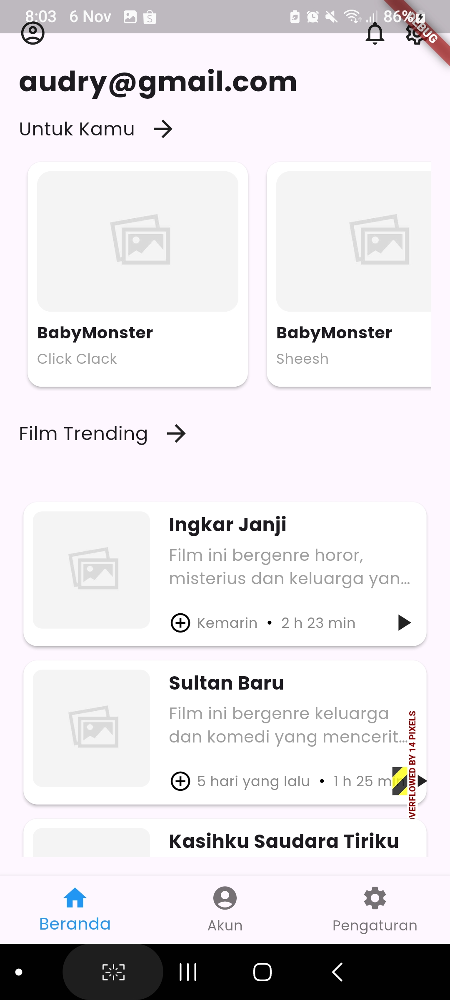
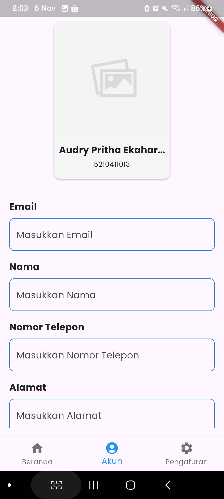
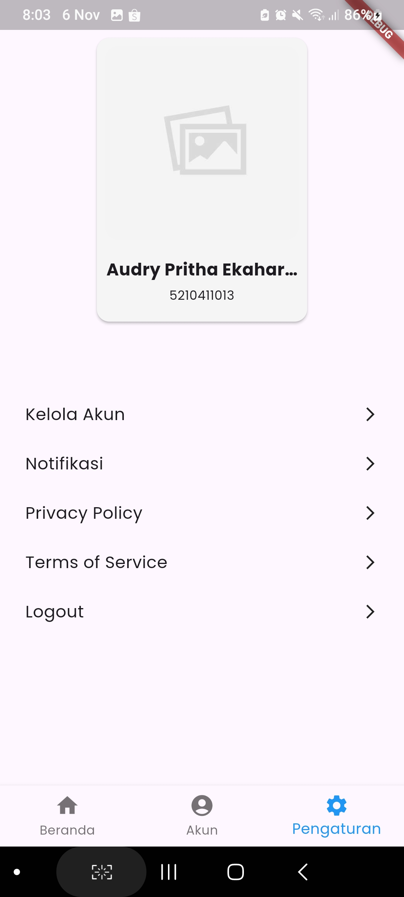

## Tampilan Aplikasi
### Tampilan Splash Screen

### Tampilan Login

### Tampilan Register

### Tampilan Lupa Password

### Tampilan Halaman Utama

### Tampilan Halaman Akun

### Tampilan Halaman Pengaturan
